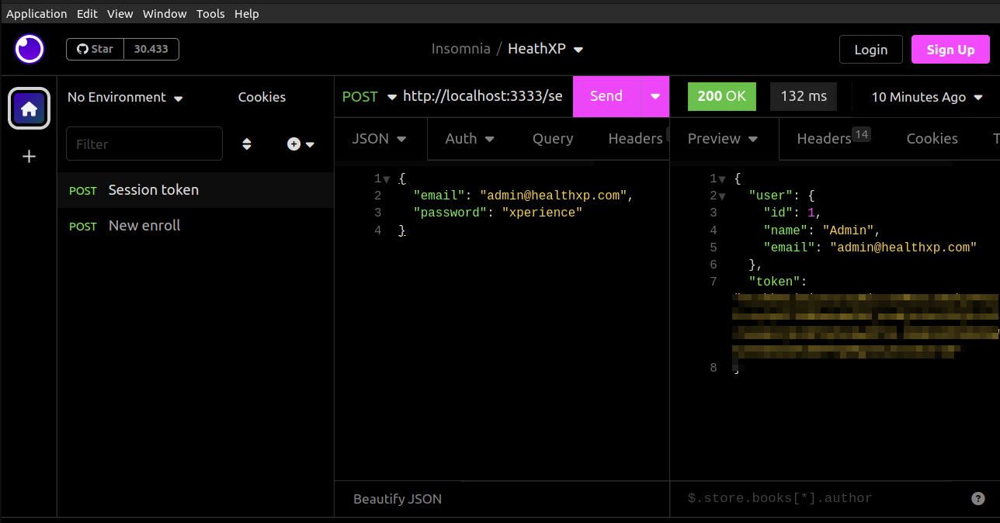
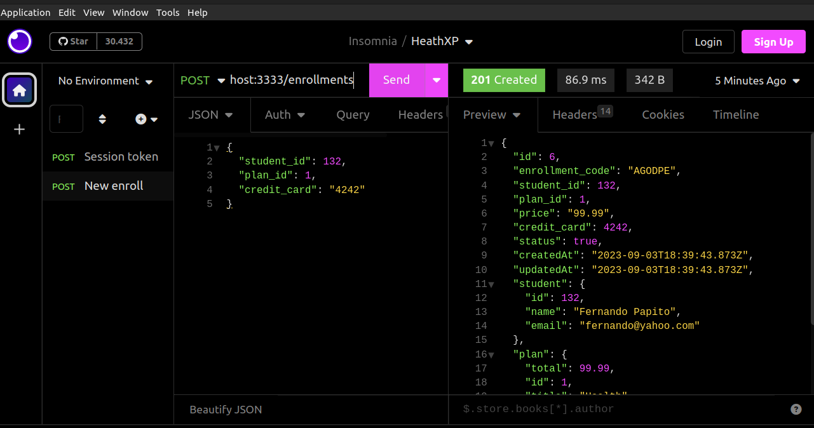

## Módulo 3 - Projeto prático de automação web
### Aula 1: Iniciando com Cypress: 
- Teste de software é composto por massa de teste que é a precondição, input que é a entrada de dados, output saída de dados 

- It -> define o caso de teste ou o cenário. 
- Contains é uma função dentro do cypress que combina elementos css e um texto

### Aula 2: Primeiros passos na automação web

- É bom externalizar a massa quando temos um software de médio-grande porte, dessa forma então fica mais organizado, nesse ponto iremos externalizar a massa que estava dentro do teste e iremos coloca-la dentro de fixtures.

### Aula 3: Cobertura de testes, Custom Commands e POM

- Esse cenário novo de alteração para quando vem uma mensagem de alerta e é necessário clica-la para tirar é o cenário mais ideal, necessário implementar isso, popUpBack() dê uma revisada.
- Aula 'Cadastro de matriculas', quando quiser pular um cenário pode usar o it.skip
- JSON -> é nativo, tem uma leitura mais simples apesar de ter mais linhas, é mais estratégico para montar massa de teste, é versátil, é desnormalizada
- Arrow function, function -> duas formas de trabalhar com function em javascript
- Custom Commands -> serve para encapsular 

### Aula 4: Variação de cenários
- Uso do forEach para testar diversos emails incorretos

### Aula 5: Tasks e conexão com o banco de dados 
- O manipulador task de eventos do plugin pode retornar um valor ou uma promessa.
.invoke -> posso invocar textos e propriedades
.then -> callback desse invoke
.push() -> é uma função nativa do Javascript para adicionar itens numa lista, array de texto ou string

- Utilizando o faker (foi usado somente como uma das estratégias, mas foi mostrado os malefícios da utilização)
- Instalando e implementado a biblioteca pg, acesso pelo site: http://node-postgres.com/apis/pool (foi recomendado usar o Pool, pois é mais simples, mas poderia usar o modo pg.Client)

### Aula 6: Avançando com componentes

- Components para poder ficar dividido e dar manutenção de forma mais "tranquila", o popup fica somente em um lugar e é invocado nas classes de StudentPage, LoginPage também. 

- Inserção do aluno via banco de dados: resetStudent (garantir que está inserindo o aluno)

### Aula 9: Cadastrando matriculas
- cy.resetStudent(dataTest.student): Se tiver com cascade:true ele apaga a matricula, se deletar um registro com matricula ele apaga todas as informações pertinentes aquele aluno 
- Verificando como funciona a API com o Insomnia, servir como guia.
1. Criando uma Collection: HeathXP;
2. Criando a primeira requisição: http://localhost:3333/enrollments
2.1 Verificar a authorization, capaz de estar errado, pode já ter expirado

Fetch/XHR -> chamadas que a API faz para consumir o back-end. 

Explicação breve sobre o Erro: 
Erro 4XX -> erro para quem está consumindo a API, o lado do cliente
Quando estou tratando informações da API, o ser humano é a terceira pessoa, a primeira "pessoa" é a aplicação que está consumindo a API

* Essa imagem mostra como ficará quando feito login: 


* Essa imagem mostra exatamente como ficará quando realizado corretamente a chamada da API: 


### Aula 10: Consumindo a API com Cypress
- Dentro de cypress.config.js o selectStudentId somente trás o Id do aluno
- Até então estavamos usando o cy.task
- O arquivo temp.json foi criado para verificar como era retornado o id do aluno 

## Módulo 4 - API Helper

#### Aula 1: Construindo minha API Helper Parte 1
A partir desse momento ele deixa de trabalhar com tasks e cria essa pasta helpers. 
- Tudo no javascript é orientado a função. 

1. Foi criado uma pasta novo no /healthxp-dual/helpers
2. Iniciado um novo projeto com npm init 
3. Ele pediu para acessar http://www.npmjs.com/package/express
4. Instala o programa com npm install express
5. Para subir a aplicação e testar se tiver correta: 
```
node app.js[nome do arquivo]
```
6. Para verificar as alterações era necessário tirar e colocar a API do ar toda vez, mas para isso não acontecer mais é necessário instalar: -> ele monitora o código
``` 
npm install nodemon
```

7. -> subir a aplicação então assim a partir de agora.
```
npx nodemon app.js
```

8. Foi usado para instalar também 
```
npm install pg
```
-> será usado o mesmo modulo para conectar no banco de dados

- Quando chamo uma task no Cypress chamo o nome da task e a massa de teste
Exemplo: cy.task('resetStudent', student)


#### Aula 2: Construindo minha API Helper Parte 2
Foram realizadas algumas operações de visualizações sobre informações inseridas dentro do banco de dados ElephantSQL com o objetivo de averiguar se estava funcionando corretamente. 

SELECT * FROM students where email 'johndoe@gmail.com'

INSERT INTO enrollments(enrollment_code, student_Id, plan_id, credit_card, status, price)
SELECT 
'XPT0123' as enrollment_code, 
id as student_id,
1 as plan_id, 
'4242' as credit_card,
true as status, 
99.99 as price
FROM students 
WHERE email 'johndoe@gmail.com

Tem alguns campos que serão customizados: email, plano, preço 

	if(student.name === '' || !student.name){
		return res.status(400).json({message: 'Name is required'})
	}
-> Para verificar se o nome campo está preenchido, porém foi utilizado uma biblioteca que poderia ajudar para verificar isso [https://www.npmjs.com/package/express-joi-validator].
```
npm install express-joi-validator
```

```
npm install joi
```

Foi feito mais algumas configurações para verificar quando não passado a informação de um campo irá vir um erro da API mostrando exatamente o que está acontecendo, também foi instalado o dotenv [https://www.npmjs.com/package/dotenv]:

```
npm i dotenv
```

Usado tanto dentro da healthxp-dual/helpers, quanto dentro do /web
- Quando mexe no arquivo de configuração do Cypress é necessário abrir e fecha-lo novamente

- O arquivo .env não deu certo, então foi utilizada outra estratégia: 
 env: {
      apiHelper: 'http://localhost:5000'
    }
dentro do cypress.config.js e as Urls do commands.js foram modificadas para Cypress.env('apiHelper')

Rodando tudo sem abrir a interface: 

```
npx cypress run
```

## Módulo 5 - Estratégias para testes de integração

#### Aula 1:  Enviando notificações através da API
POST na http://localhost:3333/students
- Como a aplicação manda essa dúvida via API? 
Consegue obter o identificador do aluno, uma vez que o aluno faz login na aplicação 

select * from students where email= 'fernando@yahoo.com';
ID do aluno 352

http://localhost:3333/students/352/help-order
JSON: {
	"question": "Enviando duvida pelo Insomnia!"
	}	

Deletar todas as notificações: 
DELETE FROM "public"."help_orders";

#### Aula 2: Reports ricos com Tesults.
https://tesults.com/docs/pricing
https://www.cypress.io/pricing

## Módulo 6: Configurando o Appium para Android 

#### Aula 1: Instalando o JDK e Android Studio 
https://developer.android.com/
https://www.java.com/pt-BR/

#### Servidor do Appium
- Foi criado uma pasta chamada appium-qax e lá foi inserido:
```
npm init
```

E depois foi inserido o comando para instalação o appium, mas somente para aquele projeto e não de forma universal:

```
npm i appium@2.0.1
```

Para colocar o appium no ar:
```
npx appium
```

- O appium é uma ferramenta e também um servidor na qual ele faz a interface com o dispositivo, o appium que vai conectar o dispositivo, mandar notificações etc
- Uma ferramenta feita em node que irá avaliar seu computador para verificar se ele está preparado para trabalhar com Appium para Android ou ios

```
npm i appium-doctor
```

- Para instalar as informações das configurações do Appium desktop:
platformName | text | Android
appium:deviceName | text | Android Emulator
appium:automationName | text | UIAutomator2
appium:app | filepath | /home/andreza/QAx2/projects/appium-qax/qax-alpha.apk

- Documentação do Appium para rodar algumas configurações que ficam faltando:
https://appium.io/docs/en/2.1/quickstart/uiauto2-driver/

```
appium driver install uiautomator2
```

- O que o Android Studio está fazendo através do scapability?
1. instalou o apk que é o pacote de distribuição do android
2. e fez uma seção que é possível inspeccionar os elementos

## Módulo 6: Projeto prático CodeceptJS & Appium

#### Aula 1: CodeceptJS para Mobile
- Iniciar um projeto com:

```
npm init
```

- Logo em seguida rodar o comando, pois essa é a versão compatível com o Appium: 

```
npm i appium@1.22.3